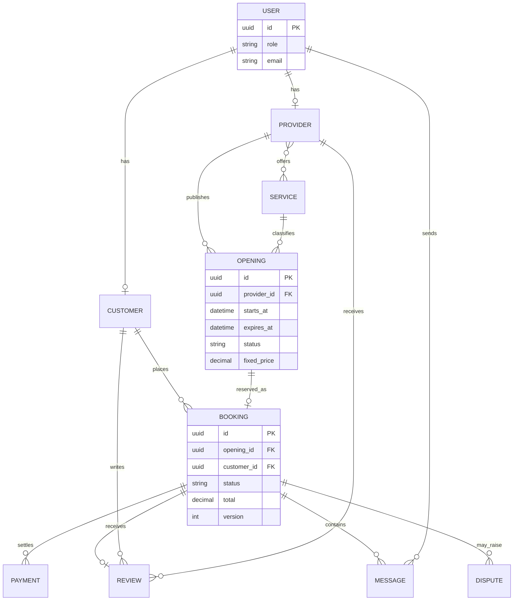

# Proposed Data Model

A `USER` owns exactly one role profile (customer or provider in the first release). Providers offer services and publish expiring openings. A customer books one opening; a booking snapshots price/scope and owns payments, a review, messages, and possible disputes. Openings require atomic status transitions to prevent double booking. Messages remain booking-scoped. Reviews require completed bookings.

Payments may have multiple attempts but one captured total. A review belongs to both booking and provider through foreign keys. A dispute references a booking and can reference payment evidence. PII and precise addresses require field-level access controls; immutable audit events record sensitive status changes.
